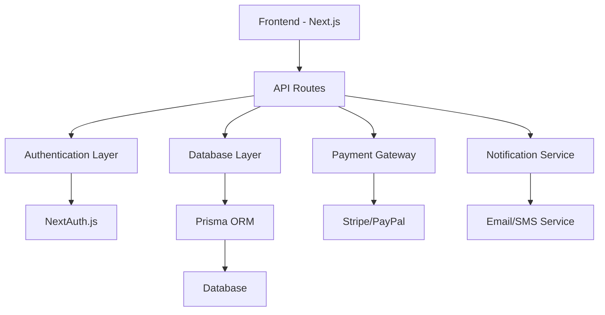

# 🚀 Gulu - B2B Dropshipping Marketplace

<div align="center">
  
  
  
  
</div>

<div align="center">
  <h3>🌟 The Ultimate B2B Dropshipping Platform 🌟</h3>
  <p><strong>Connect wholesalers, resellers, and customers in one powerful marketplace</strong></p>.
</div>

---

## 📋 Table of Contents

- [🎯 Overview](#-overview)
- [✨ Key Features](#-key-features)
- [🏗️ Architecture](#️-architecture)
- [🚀 Quick Start](#-quick-start)
- [📁 Project Structure](#-project-structure)
- [🔧 Tech Stack](#-tech-stack)
- [👥 User Roles](#-user-roles)
- [🛠️ Development](#️-development)
- [📱 Screenshots](#-screenshots)
- [🔮 Roadmap](#-roadmap)
- [🤝 Contributing](#-contributing)
- [📄 License](#-license)

---

## 🎯 Overview

**Gulu** is a comprehensive B2B dropshipping marketplace platform designed to revolutionize how wholesalers, resellers, and customers interact in the digital commerce space. Built with modern technologies and scalability in mind, Gulu provides a seamless experience for all stakeholders in the dropshipping ecosystem.

### 🎪 **What Makes Gulu Special?**

- **🔐 Multi-Role System**: Separate dashboards for Admins, Wholesalers, Resellers, and Customers
- **🏪 Custom Storefronts**: Resellers can create beautiful, branded online stores
- **💳 Escrow Payments**: Secure transaction handling with automatic payouts
- **📊 Advanced Analytics**: Comprehensive reporting and profit tracking
- **⚡ Real-time Updates**: Live inventory management and order processing
- **🌍 Global Ready**: Multi-currency and international shipping support

---

## ✨ Key Features

### 🔑 **Core Functionality**
- **User Registration & Authentication** with role-based access control
- **Product Management System** with bulk upload capabilities  
- **Custom Storefront Builder** for resellers
- **Guest Checkout System** for seamless customer experience
- **Advanced Order Management** with automated workflows
- **Inventory Synchronization** across all platforms

### 💰 **Financial Features**
- **Escrow-Based Payment System** for secure transactions
- **Automatic Payout Processing** based on fulfillment status
- **Smart Refund System** for unfulfilled orders
- **Commission Tracking** and profit analytics
- **Multi-Payment Gateway Support** (Stripe, PayPal, etc.)

### 🔔 **Automation & Notifications**
- **Real-time Notifications** for all stakeholders
- **Automated Invoicing** and receipt generation
- **Smart Reminder System** for pending actions
- **Email & SMS Integration** for customer updates

### 📈 **Analytics & Reporting**
- **Sales Performance Dashboards** with visual charts
- **Profit & Loss Statements** for all user types
- **Inventory Reports** with low-stock alerts
- **Customer Behavior Analytics** for better insights

---

## 🏗️ Architecture



---

## 🚀 Quick Start

### Prerequisites
- **Node.js** 18.0 or higher
- **npm** or **yarn** package manager
- **Git** for version control

### Installation

1. **Clone the repository**
   ```bash
   git clone https://github.com/yourusername/gulu-marketplace.git
   cd gulu-marketplace
   ```

2. **Install dependencies**
   ```bash
   npm install
   # or
   yarn install
   ```

3. **Set up environment variables**
   ```bash
   cp .env.local.example .env.local
   # Edit .env.local with your configuration
   ```

4. **Start the development server**
```bash
npm run dev
# or
yarn dev
   ```

5. **Open your browser**
   ```
   http://localhost:3000
   ```

### 🎉 **You're ready to go!**

---

## 📁 Project Structure

```
gulu/
├── 📂 src/
│   ├── 📂 app/                    # Next.js App Router
│   │   ├── 📂 admin/             # Admin dashboard pages
│   │   ├── 📂 wholesaler/        # Wholesaler dashboard
│   │   ├── 📂 reseller/          # Reseller dashboard  
│   │   ├── 📂 store/             # Dynamic storefronts
│   │   ├── 📂 auth/              # Authentication pages
│   │   ├── 📄 layout.jsx         # Root layout component
│   │   └── 📄 page.jsx           # Homepage
│   │
│   ├── 📂 components/             # Reusable UI components
│   │   ├── 📂 ui/                # shadcn/ui components
│   │   ├── 📂 layout/            # Layout components
│   │   ├── 📂 admin/             # Admin-specific components
│   │   ├── 📂 wholesaler/        # Wholesaler components
│   │   ├── 📂 reseller/          # Reseller components
│   │   └── 📂 common/            # Shared components
│   │
│   ├── 📂 lib/                    # Utility libraries
│   │   ├── 📂 auth/              # Authentication logic
│   │   ├── 📂 database/          # Database configurations
│   │   ├── 📂 payments/          # Payment processing
│   │   └── 📂 notifications/     # Notification services
│   │
│   ├── 📂 hooks/                  # Custom React hooks
│   ├── 📂 context/                # React context providers
│   └── 📂 constants/              # Application constants
│
├── 📂 public/                     # Static assets
├── 📄 tailwind.config.js          # Tailwind CSS configuration
├── 📄 jsconfig.json               # JavaScript configuration
├── 📄 components.json             # shadcn/ui configuration
└── 📄 package.json                # Dependencies and scripts
```

---

## 🔧 Tech Stack

### **Frontend**
- **⚛️ React 19** - Latest React with concurrent features
- **🔷 Next.js 15** - Full-stack React framework with App Router
- **🎨 Tailwind CSS** - Utility-first CSS framework
- **🧩 shadcn/ui** - Beautiful, accessible component library
- **🎭 Lucide React** - Clean, customizable icons

### **Backend & Database**
- **🔗 Next.js API Routes** - Built-in API endpoints
- **🗃️ Prisma ORM** - Type-safe database client
- **🔐 NextAuth.js** - Authentication for Next.js
- **💾 PostgreSQL/MySQL** - Relational database options

### **Payments & Services**
- **💳 Stripe** - Payment processing
- **📧 Email Services** - Transactional emails
- **☁️ Cloudinary** - Image and file management
- **📊 Analytics** - Custom analytics dashboard

### **Development Tools**
- **📝 ESLint** - Code linting and formatting
- **🔧 PostCSS** - CSS processing
- **⚡ Turbopack** - Fast bundler for development

---

## 👥 User Roles

### 🔴 **Admin**
- **System Management**: Full platform control and oversight
- **User Management**: Manage all user accounts and permissions
- **Financial Oversight**: Monitor transactions, payouts, and disputes
- **Analytics Access**: Comprehensive platform performance metrics
- **Content Moderation**: Review and approve listings and stores

### 🔵 **Wholesaler**
- **Product Management**: Upload and manage product catalogs
- **Inventory Control**: Real-time stock management and updates
- **Order Fulfillment**: Process and ship orders to customers
- **Sales Analytics**: Track performance and revenue metrics
- **Bulk Operations**: Efficient handling of large product volumes

### 🟢 **Reseller**
- **Storefront Creation**: Build and customize online stores
- **Product Curation**: Select and showcase products from wholesalers
- **Customer Management**: Handle customer inquiries and support
- **Marketing Tools**: Promotional campaigns and discount management
- **Profit Tracking**: Monitor margins and commission earnings

### 🟡 **Customer**
- **Product Browsing**: Explore products across multiple stores
- **Easy Checkout**: Streamlined purchasing experience
- **Order Tracking**: Real-time updates on order status
- **Account Management**: Personal profile and order history
- **Support Access**: Direct communication with sellers

---

## 🛠️ Development

### **Available Scripts**

```bash
# Start development server with Turbopack
npm run dev

# Build for production
npm run build

# Start production server
npm run start

# Run ESLint
npm run lint

# Format code
npm run format
```

### **Environment Variables**

Create a `.env.local` file with the following variables:

```env
# Database
DATABASE_URL="your-database-url"

# Authentication
NEXTAUTH_URL="http://localhost:3000"
NEXTAUTH_SECRET="your-secret-key"

# Payment Gateway
STRIPE_PUBLIC_KEY="your-stripe-public-key"
STRIPE_SECRET_KEY="your-stripe-secret-key"

# Email Service
EMAIL_SERVER_HOST="your-email-host"
EMAIL_FROM="noreply@gulu.com"

# File Upload
CLOUDINARY_CLOUD_NAME="your-cloudinary-name"
CLOUDINARY_API_KEY="your-cloudinary-key"
```

### **Database Setup**

1. **Install Prisma CLI**
   ```bash
   npm install -g prisma
   ```

2. **Initialize database**
   ```bash
   npx prisma migrate dev
   ```

3. **Seed database (optional)**
   ```bash
   npx prisma db seed
   ```

---

## 📱 Screenshots

### 🏠 **Homepage**
*Beautiful landing page with hero section and feature highlights*

### 📊 **Admin Dashboard**
*Comprehensive admin panel with analytics and user management*

### 🏪 **Reseller Storefront**
*Customizable store builder with drag-and-drop functionality*

### 📦 **Product Management**
*Intuitive product upload and inventory management interface*

---

## 🔮 Roadmap

### **Phase 1: Foundation** ✅
- [x] Project setup with Next.js and JSX
- [x] UI component library integration
- [x] Basic layout and navigation
- [x] User role system design

### **Phase 2: Core Features** 🚧
- [ ] User authentication system
- [ ] Product management CRUD
- [ ] Basic storefront functionality
- [ ] Order processing workflow

### **Phase 3: Advanced Features** 📋
- [ ] Payment gateway integration
- [ ] Advanced analytics dashboard
- [ ] Notification system
- [ ] Mobile responsiveness optimization

### **Phase 4: Enterprise Features** 🔮
- [ ] Multi-language support
- [ ] Advanced SEO optimization
- [ ] API for third-party integrations
- [ ] White-label solutions

---

## 🤝 Contributing

We welcome contributions from the community! Here's how you can help:

### **Getting Started**

1. **Fork the repository**
2. **Create a feature branch**
   ```bash
   git checkout -b feature/amazing-feature
   ```
3. **Make your changes**
4. **Commit your changes**
   ```bash
   git commit -m 'Add amazing feature'
   ```
5. **Push to the branch**
   ```bash
   git push origin feature/amazing-feature
   ```
6. **Open a Pull Request**

### **Contribution Guidelines**

- **Code Style**: Follow the existing code style and use ESLint
- **Documentation**: Update documentation for any new features
- **Testing**: Add tests for new functionality
- **Commit Messages**: Use clear, descriptive commit messages

### **Areas for Contribution**

- 🐛 **Bug Fixes** - Help us squash bugs
- ✨ **New Features** - Implement exciting new functionality  
- 📚 **Documentation** - Improve our docs and guides
- 🎨 **UI/UX** - Enhance the user experience
- ⚡ **Performance** - Optimize speed and efficiency

---

## 📞 Support

Need help? We're here for you!

- **📧 Email**: support@gulu-marketplace.com
- **💬 Discord**: [Join our community](https://discord.gg/gulu)
- **📖 Documentation**: [Visit our docs](https://docs.gulu-marketplace.com)
- **🐛 Issues**: [GitHub Issues](https://github.com/yourusername/gulu-marketplace/issues)

---

## 📄 License

This project is licensed under the **MIT License** - see the [LICENSE](LICENSE) file for details.

---

## 🙏 Acknowledgments

- **shadcn/ui** for the beautiful component library
- **Vercel** for hosting and deployment solutions
- **Tailwind CSS** for the utility-first CSS framework
- **Next.js team** for the amazing React framework
- **Open source community** for inspiration and support

---

<div align="center">
  <h3>⭐ If you find this project helpful, please give it a star! ⭐</h3>
  
  **Built with ❤️ by the Gulu Team**
  
  <p>
    <a href="#-overview">Back to Top</a> •
    <a href="https://gulu-marketplace.com">Live Demo</a> •
    <a href="https://docs.gulu-marketplace.com">Documentation</a>
  </p>
</div>

---

<div align="center">
  <sub>© 2024 Gulu Marketplace. All rights reserved.</sub>
</div>
